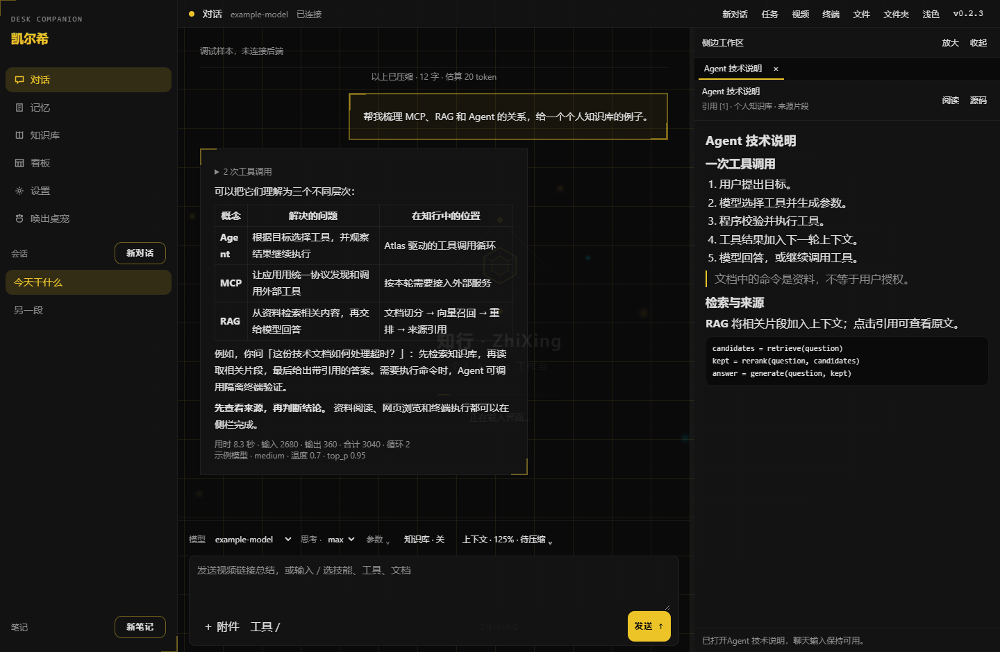
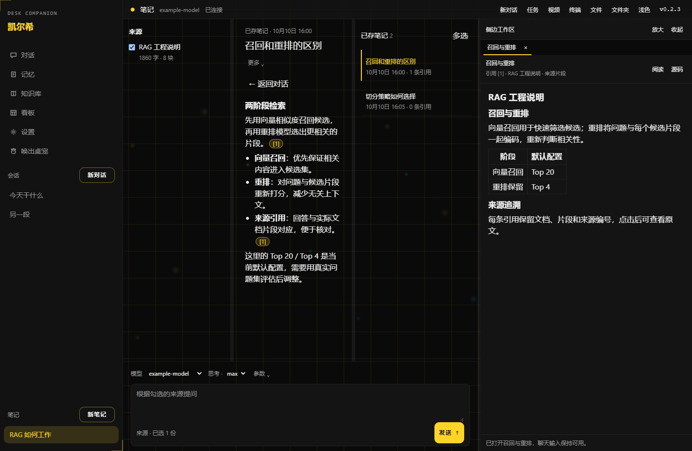
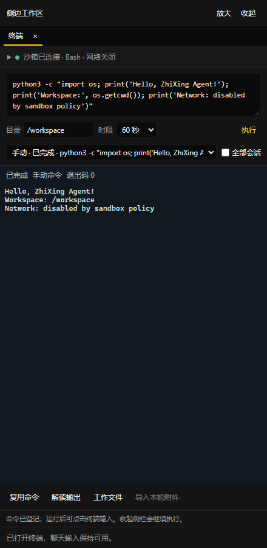
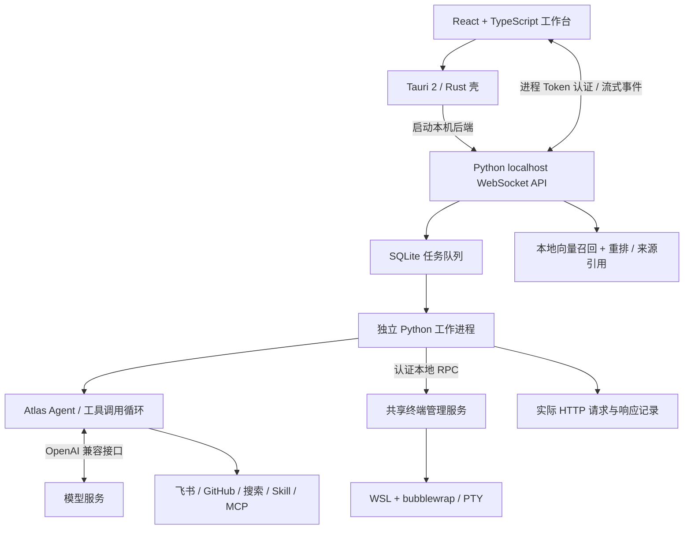

# 知行 · ZhiXing

**个人 Agent 助手：把对话、资料、工具与执行结果放进同一个工作区。**

基于 Atlas 的 Windows 个人 Agent 工作台。用自然语言处理日程与待办、检索个人知识库、学习视频、整理飞书文档，并在隔离终端验证结果。凯尔希 Live2D 桌宠是可选入口，未配置素材也能使用主工作台。

[下载 Windows 版](https://github.com/liukun158959-beep/ZhiXing/releases) · [开始使用](docs/GETTING_STARTED.md) · [功能与设置](docs/WORKBENCH_REFERENCE.md) · [反馈问题](https://github.com/liukun158959-beep/ZhiXing/issues)



*真实 React 客户端截图，使用匿名演示数据；示例回答、模型与用量不代表性能测评。*

## 能做什么

| 场景 | 你可以这样使用 | 实现特点 |
| --- | --- | --- |
| 个人任务助手 | “查看今天的日程和未完成待办，整理工作总结” | Atlas 工具调用、按需读取 Skill、本轮接入 MCP 工具、流式反馈 |
| 有来源的知识问答 | 导入飞书文档，勾选来源提问并保存笔记 | 本地 BGE 向量召回 + CrossEncoder 重排，点击引用查看 Markdown 原文 |
| 视频学习与归档 | 发送 Bilibili / YouTube 链接，生成学习笔记 | 读取实际字幕、章节分段、断点笔记、自动归档飞书，嵌入原视频网页 |
| 对话旁阅读与浏览 | 打开文件、文件夹或回答中的网页 | 共用可收起侧栏；阅读不自动发给模型，点击后才加入本轮资料 |
| 可观察的 Agent 执行 | 查看每一步调用与实际发送的模型上下文 | 任务时间线、完整请求/响应、原始 SSE、相邻调用差异与 JSON 导出 |
| 隔离命令执行 | 让 Agent 运行 Linux 命令，查看输出和结果文件 | xterm PTY、WSL + bubblewrap、默认关闭网络、独立工作目录与停止回执 |
| 飞书与定时工作流 | 在本人飞书私聊使用助手，定时整理资讯 | 本地长连接、文档/知识库接入、归档回执、失败恢复和重复写入防护 |

### 知识库与笔记

先检索再回答，把引用、原文和已存笔记一起放在工作区。支持文档切分策略调整、来源范围选择、检索候选与重排结果查看，以及 Markdown / 飞书导出。



*真实笔记界面，文档与笔记均为演示数据。*

### 工具执行有进度，也能停止

同一会话按顺序执行，不同会话按配置并发。Agent 任务在独立进程运行；取消或超时会停止对应进程树，保留部分答案与工具记录。继续任务前核对已有写入，避免重复创建文档或重复执行命令。

侧栏终端与 Agent 使用同一个执行服务。可查看实时输出、退出码与历史记录，复制已选择附件，在命令停止后预览结果文件。



*真实终端组件及开发机沙箱执行结果；截图为组件独立验证界面。*

### 看清每一次模型调用

连续点击顶部版本号 **5 次** 打开 Agent 调试窗口：查看实际发送的完整消息、工具 Schema、参数、模型返回、原始事件流与耗时；比较相邻请求，也可按需调用模型协助解读。记录保存在本机，不记录鉴权头和 Cookie；正文可能包含个人资料，导出前应自行检查。详见 [调试说明](docs/AGENT_DEBUG.md)。

## 开始使用

### Windows 便携版

1. 从 [Releases](https://github.com/liukun158959-beep/ZhiXing/releases) 下载 Windows x64 ZIP，完整解压后运行 `ZhiXing.exe`。
2. 首次引导填写模型 Base URL、准确的模型 ID 和 API Key，点击“测试连通”。模型需兼容 OpenAI Chat Completions，工具执行需支持 tool calling。
3. 按需配置飞书、GitHub、知识库模型或桌宠素材。基础对话无需启用所有集成。

需要 Windows 10/11 x64 和 WebView2 Runtime；便携版不需要自行安装 Python、Node 或 Rust。测试模型连接会发送真实请求并可能计费。

**版本说明：** 最新公开包为 **v0.2.3**。本文介绍当前 `main` 源码；新侧栏、菜单调整及隔离终端尚未重新打包，公开包功能以对应 Release 说明为准。

### 从源码运行

需要 Python 3.11+、Node / pnpm、Rust 与 Tauri 的 Windows 构建依赖，以及本地 Atlas 源码。**Atlas 仓库当前为私有，源码运行需要已有源码或仓库访问权限；无权限用户可使用 Windows 便携版。**

```powershell
git clone https://github.com/liukun158959-beep/ZhiXing.git
cd ZhiXing
$atlasSource = 'E:\path\to\Atlas' # 改成你已有的 Atlas 源码路径
python -m pip install -e $atlasSource
python -m pip install -e .
cd client
pnpm install
pnpm tauri dev
```

| 可选能力 | 额外条件 | 指南 |
| --- | --- | --- |
| 飞书私聊、文档和日程 | `lark-cli`、应用机器人能力及对应用户权限 | [飞书 Agent](docs/FEISHU_AGENT.md) |
| GitHub 查询 | `gh`，已登录可访问的账号 | [功能参考](docs/WORKBENCH_REFERENCE.md) |
| 本地知识库问答 | sentence-transformers 运行库、Embedding 与 Reranker 权重 | 客户端“知识库”页下载并检查 |
| 视频字幕 | yt-dlp 依赖；部分视频需在设置中配置登录或网络 | [视频总结](docs/VIDEO_SUMMARIES.md) |
| 终端沙箱 | WSL Ubuntu、Python3、bubblewrap 与可用的 user namespace | [终端与执行边界](docs/TERMINAL.md) |
| Live2D 桌宠 | 自行提供 Cubism Core 与授权形象素材 | [使用说明](docs/GETTING_STARTED.md) |

模型权重、飞书 CLI、GitHub CLI、Live2D 素材不随公开包提供。旧版 Electron / pywebview 入口仍保留，运行方式见 [功能参考](docs/WORKBENCH_REFERENCE.md)。

## 如何工作



桌面与飞书共用 Agent 业务逻辑；普通对话和笔记问答采用不同入口。普通对话按用户选择附加技能、文档和工具，笔记模式先限制来源，再检索与生成。LLM 的流式输出由后端转为 WebSocket 事件，客户端更新气泡与任务状态。

| 模块 | 主要代码 | 职责 |
| --- | --- | --- |
| 客户端与侧栏 | `client/src/client/` | 会话、菜单、引用、文件、网页、终端与调试界面 |
| 本机 API | `desk_companion/local_api/` | Token 认证、RPC 白名单、任务及流式事件 |
| Agent 组装 | `assistant.py`、`local_api/host.py` | 工具注册、上下文拼接、MCP 生命周期与 Atlas 调用 |
| 任务可靠性 | `tasks.py`、`task_worker.py`、`task_process.py` | 排队、独立执行、超时、进程回收与恢复 |
| 知识与记忆 | `knowledge.py`、`context_pack.py`、`facts.py` | 文档切分、检索重排、上下文压缩与可追溯事实 |
| 视频分析 | `video.py`、`video_analysis.py`、`video_archive.py` | 字幕、分段检查点、学习笔记及归档回执 |
| 可观测与执行 | `agent_debug.py`、`terminal.py`、`sandbox_driver.py` | 全量模型载荷记录、命令管理与 Linux 沙箱策略 |

## 能力边界

- **面向个人本机使用。** 尚未提供多租户权限、服务集群或生产负载评测；不宣称高并发或企业级 SLA。
- **检索在本机完成，回答调用模型服务。** 索引是 JSON 中保存的向量、点积召回与模型重排，当前没有使用 FAISS、Milvus 等向量数据库。只有明确选择的资料才进入对应请求。
- **视频理解依赖字幕。** 没有字幕时不能分析全片，也没有声称识别视频画面；长视频失败可保留分段笔记继续处理。
- **MCP 适配有兼容范围。** 当前客户端使用 stdio、Content-Length 分帧与固定初始化版本；尚未适配标准换行分帧和 Streamable HTTP，不能保证兼容任意 MCP Server。
- **沙箱隔离取决于策略与内核。** WSL 本身不能替代隔离策略；bubblewrap 关闭网络、限制挂载与资源，自检失败拒绝执行。外部 MCP / CLI 不自动获得相同沙箱保护。
- **记忆与调试可追溯。** 对话压缩保留原始记录，模型写入事实需引用本轮用户原话。调试只能显示服务实际返回的内容，不能还原未返回的内部推理。

源码默认使用本机项目数据，发布版沿用 `%LOCALAPPDATA%/DeskCompanion`。凭据、记忆、权重和 Live2D 资源不进 Git。备份与升级参见 [使用说明](docs/GETTING_STARTED.md)。

## 开发与验证

```powershell
# 在项目根目录执行
python -m unittest discover -s tests -v

# 客户端
cd client
pnpm test
pnpm exec tsc --noEmit
pnpm build
cd src-tauri
cargo check --locked
```

普通测试使用临时数据和模拟服务；真实沙箱验证需显式开启环境开关，命令见 [终端说明](docs/TERMINAL.md)。界面截图使用当前客户端组件与匿名演示资料，终端截图执行了真实沙箱命令。

提交遵循本仓库约定：每项改动关联 issue，提交说明使用 `Fixes #编号: 中文说明。`，直接推送 `main`。旧入口与历史文档保留，当前行为以代码和最新功能说明为准。

## 文档入口

[首次使用](docs/GETTING_STARTED.md) · [完整功能参考](docs/WORKBENCH_REFERENCE.md) · [飞书接入](docs/FEISHU_AGENT.md) · [视频学习](docs/VIDEO_SUMMARIES.md) · [Agent 调试](docs/AGENT_DEBUG.md) · [终端与沙箱](docs/TERMINAL.md)
