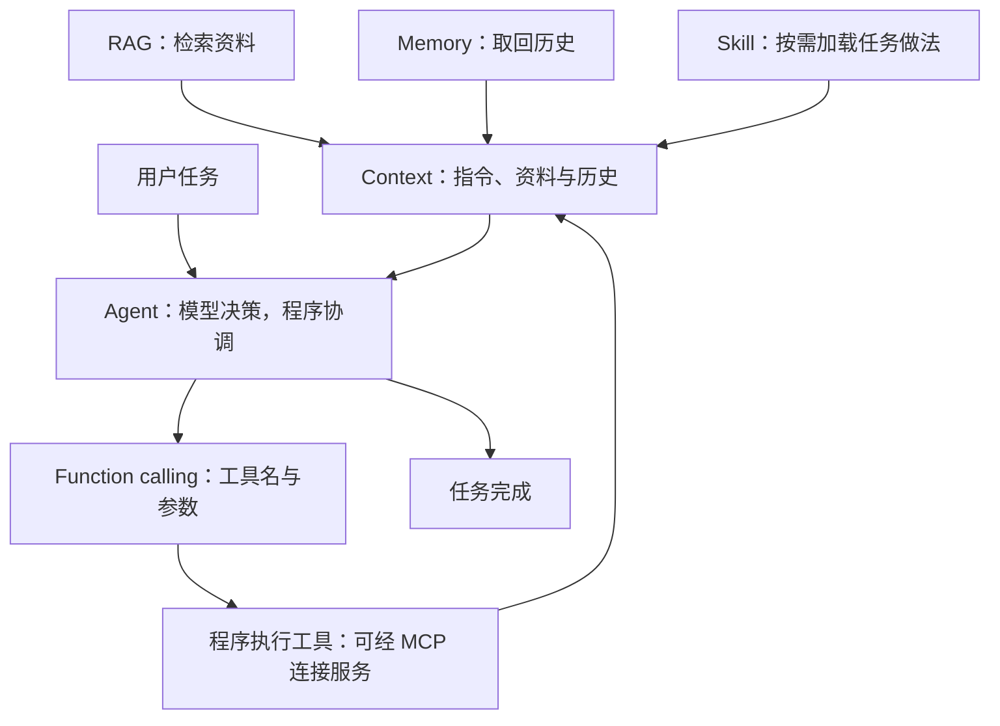

# AI 热词速查：这些概念怎样组成一个应用

> 根据已取得的 442 段字幕与补充资料整理。本稿按本次反馈编辑，展示精简结构，未重新运行模型。

视频主线：这些热词分别解决“模型需要哪些信息、如何调用外部能力、如何组织任务”的问题。理解它们的职责和关系，比记住名字更有用。

## 先看懂这些词

下表以视频概念为主，结合通用技术解释。

| 概念 | 通俗定义 | 解决什么问题 |
|---|---|---|
| LLM | 根据输入生成语言内容的模型 | 理解需求、生成答案，并参与任务决策 |
| Prompt / Context | Prompt 通常侧重任务指令；Context 是模型本次可用的信息，包括指令、历史与资料 | 告诉模型要做什么、依据什么 |
| Memory | 系统保存并在需要时取回的历史与事实 | 让后续任务能使用之前的信息，未必是模型自己记住了 |
| RAG | 先检索相关资料，再交给模型生成答案 | 使用企业文档、新资料等模型参数之外的信息 |
| Function calling | 模型提出结构化的工具调用请求，由程序执行 | 将“我想查日程”变成可执行的工具名和参数 |
| MCP | 应用连接外部服务、发现和调用能力的一套标准约定 | 减少每个工具都要单独适配的工作 |
| Skill | 按需加载的任务说明与资源包，可以带脚本 | 给 Agent 提供某类任务的做法与规则 |
| Workflow | 预先编排步骤和分支，必要节点调用模型 | 让任务沿设计好的流程执行 |
| Agent | 模型参与选择下一步，程序执行工具并回传结果，循环完成任务 | 处理需要多步判断和行动的需求 |
| Sub-agent | 把子任务交给有独立上下文的 Agent，再汇总结果 | 分工处理复杂任务，隔离各子任务的信息 |

字幕定位：RAG 03:42 · MCP 05:18 · Skill 08:00（在飞书文档的内嵌原视频中跳转）。

## 放在一起，关系就清楚了

这是围绕视频主题的 **LLM 应用技术概览**，并非全部 AI 技术：

关系示意包含补充解释；Workflow 可预设步骤，Sub-agent 可承担子任务。

- **模型层**：LLM 负责生成和判断。
- **信息层**：Prompt、Context、Memory、RAG 提供任务指令与证据。
- **工具层**：Function calling 表达模型的调用意图；MCP 连接外部能力。
- **任务组织层**：Workflow 预先安排流程；Agent 运行时参与决策；Skill 提供任务知识；Sub-agent 用于分工。它们可以组合。

框架和产品是另一类名字：**LangChain** 提供构建模型应用与 Agent 的组件；**OpenClaw** 是把模型、工具和聊天入口等组合起来的助手产品。它们不是与 RAG、MCP 平行的一项底层机制。[LangChain 官方概览](https://www.langchain.com/oss-overview)、[OpenClaw 官方仓库](https://github.com/openclaw/openclaw)。

## 三个关联名词，补上 RAG 的理解缺口

- **Embedding（嵌入）**：把文本等内容转换成一串数字，让程序能比较内容的相似程度。
- **向量检索**：利用这些数字查找相似内容；相似不等于正确，旧规则也可能很相似。
- **Rerank（重排）**：对检索出的候选资料再排序，让更相关的内容靠前。

常见组合是“检索候选 → 重排筛选 → 放入上下文 → 生成回答”；RAG 不必只用向量检索，关键是取回有用的外部证据。

## 一个短例子串起来（补充例子）

“按公司的差旅规定帮我准备申请”：RAG 找到相关制度，Memory 补上已知偏好，Skill 提供填表规则；Agent 决定下一步，通过 function calling 请求工具，程序可以经 MCP 调用外部表单服务。固定的审批步骤则可以由 Workflow 编排。

只需记住两个边界：Skill 的脚本是可选的；“Skill 会淘汰 MCP”属于作者预测，不能据此认为两者做的是同一件事。[Skill 规范](https://agentskills.io/specification)、[MCP 架构说明](https://modelcontextprotocol.io/docs/2026-07-28/learn/architecture)。

来源：飞天闪客原视频（飞书文档内嵌网页）。已读全部可用自动字幕；未读取画面，术语识别可能有误。概念关系、关联名词与短例子属于补充解释。
